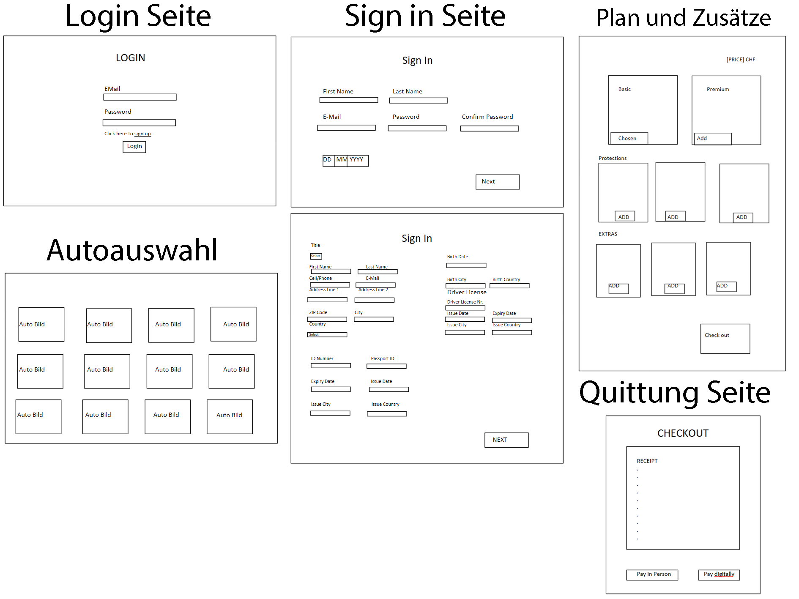

# Projektarbeit IPT 6.1

# Rent Cars  von Yunes El Hamad & Roman Konarski

## Meet the developers!

**Yunes El Hamad** & **Roman Konarski** sind die entwickler dieser Webapp. Während das 4. Semester ihrer Ausbildung haben sie eine Vielzahl von Stunden daran gearbeitet. 

## Inhaltverzeichnis

1. [Arbeitsjournal](#arbeitsjournal)
2. [Projektidee](#projektidee)
3. [Projektbeschreibung](#projektbeschreib)
4. [Funktionalität & Ziel](#funktionalität--ziel)
5. [Features](#features)
6. [Benutzerseitige Validierung](#benutzerseitige-validierung)
7. [Datentypen](#datentypen)
8. [Projektplanung](#projektplanung)
9. [Architektur/Design](#architekturdesign)
10. [Prototyping](#prototyping)
11. [Implementation](#implementation)
12. [Testing](#testing)
13. [Projektpräsentation](#projektpräsentation)
14. [Schlussreflexion](#schlussreflexion)

## Arbeitsjournal

Für der Arbeitsjournal, finden sie alles in die Commit history.

## Projektidee

Wir erstellen eine Webseite für ein Unternehmen das Autos vermietet.

## Projektbeschreib

Auf der Webseite sollte man sich einloggen oder ein Konto erstellen können. Man sollte auch können Autos mieten und auswählen, was für Versicherung man will oder ob man Kindersitze braucht. Die Webseite berechnet auch den Preis vom Auto der sich unterscheidet abhängend von der Zeit, für die es vermietet wird.

## Funktionalität & Ziel 

Unsere Softwareanwendung ist eine umfassende Plattform für die Verwaltung von Autovermietungen, die darauf abzielt, den gesamten Prozess der Fahrzeugvermietung zu vereinfachen. Sie bietet Funktionen wie die Online-Reservierung und -Verwaltung von Fahrzeugen.

## Features

**Account erstellug**  
**Fahrzeuge hinzufügen und löschen**  
**Vermietungsprozess nachahmen**

## Benutzerseitige Validierung

Bei der Registrierung wird der Benutzer informiert ob er ein Fehler begangen hat.  
Bei der Login wird der Benutzer informiert ob er ein falsches Password eingegeben hat oder ob beide Username und Password falsch sind.

## Datentypen

| **Feld**          | **Datentyp**  |
|-------------------|---------------|
| UID               | int           |
| Firstname         | string        |
| Lastname          | string        |
| E-Mail            | string        |
| Password          | string        |
| Phone             | string        |
| Address           | string        |
| ZIP               | int           |
| City              | string        |
| Country           | string        |
| Birthdate         | DateTime      |
| Birth City        | string        |
| Birth Country     | string        |
| DL Number         | int           |
| Issue Date        | DateTime      |
| Expiry Date       | DateTime      |
| Issue City        | string        |
| Issue Country     | string        |
| ID Number         | int           |
| Passport Number   | int           |
| Expiry Date       | DateTime      |
| Issue Date        | DateTime      |
| Issue City        | string        |
| Issue Country     | string        |
| CID               | int           |
| CarName           | string        |
| CarBrand          | string        |
| Seats             | int           |
| Doors             | int           |
| IsAutomatic       | bool          |
| HorsePwr          | double        |
| CarPic            | string        |
| CarPrice          | double        |
| Name              | string        |
| Description       | string        |
| ImagePath         | string        |
| Price             | double        |
| IsSelected        | bool          |

## Projektplanung

| Datum | Roman | Yunes |
|-------|-------|-------|
| 19.02 | Idee Findung und Planung anfangen | Idee Findung und Planung anfangen |
| 26.02 | Planung beenden | Planung beenden |
| 04.03 | PAP + Mockup | PAP + Auflistung Datentypen von möglichen Eingaben und Definierung von Pflichtfeldern |
| 11.03 | PAP | Mockup design + Datentypen |
| 18.03 | PAP | Mockup design |
| 25.03 | Buffer Zone + Arbeit überprüfen | Buffer Zone + Arbeit überprüfen |
| 01.04 | Ferien | Ferien |
| 08.04 | Ferien | Ferien |
| 15.04 | App entwerfen | App entwerfen |
| 22.04 | App entwerfen | App entwerfen |
| 29.04 | App funktioniert + Datenbank + Arbeit überprüfen | App funktioniert + Datenbank + Arbeit überprüfen |
| 06.05 | Anfange Usability + User Friendliness + UI für Hilfestellungs- und Feedbackmöglichkeiten einbauen | Anfange Usability + User Friendliness + Logik für Hilfestellungs- und Feedbackmöglichkeiten einbauen |
| 13.05 | Usability + User Friendliness + UI für Hilfestellungs- und Feedbackmöglichkeiten einbauen | Usability + User Friendliness + Logik für Hilfestellungs- und Feedbackmöglichkeiten einbauen |
| 20.05 | Feiertag | Feiertag |
| 27.05 | Buffer Zone + Arbeit überprüfen | Buffer Zone + Arbeit überprüfen |
| 03.06 | Buffer Zone + Arbeit überprüfen | Buffer Zone + Arbeit überprüfen |
| 10.06 | Arbeit beenden und letzter Check | Arbeit beenden und letzter Check |
| 17.06 | Abgabe | Abgabe |

## Architektur/Design

## Prototyping

Während die verarbeitung dieses Projekt haben wir keines grosseren Protoyp benutzt, sondern immer alles innerhalb die gleiche Projektmappe versucht und getestet

## Implementation 

Wir hatten angefangen aber kamen ziemlich schnell zu einen stopping punkt wegen die Datenbank verbindung. Diese konnten wir schlussendlich lösen in dem wir die queries online fanden und die restliche syntax von einen alten Projekt übernahmen.

## Testing

Das Testing haben wir mithilfe von einen simpleren Unittest und in dem wir die Applikation tatsächlich benutzten.

## Projektpräsentation

Die Projektpräsentation haben wir durch einen Video gemacht, den finden sie im Repository.

## Schlussreflexion

Wir konnten die Planung nicht ganz beinhalten wegen unsere andere Projekte und wegen öfters Abgelenkt werden. Wir haben erst zu spät die Datenbankverbindung fertiggestellt und deswegen hatten wir weniger Zeit für der Rest.
